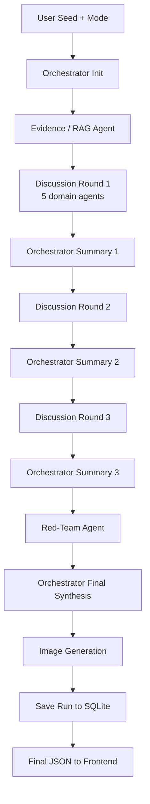

# Cold War Scenario Simulator

A local multi-agent AI application that generates a five-year (2026–2031)
plausible USA–China rivalry scenario from a single seed sentence. Built as a
portfolio project to demonstrate **LangGraph orchestration, multi-agent
discussion, RAG, structured outputs, image generation, SQLite caching, and
unit-tested production-style Python**.

> Disclaimer: this app produces *one plausible scenario*, not a prediction.
> It stays at the strategic / scenario-planning level and explicitly avoids
> operational military detail, targeting, or instructions for real-world
> harm. See the safety constraint inside `app/agents.py`.


# you can see an example for a senrio in app. 
---

## Why this is an "agentic" AI system

The app is not a single prompt. It is a graph of specialized agents that
collaborate, disagree, revise their positions, and get critiqued by a
red-team before a final orchestrator synthesizes them:

- **Orchestrator** initializes state, summarizes each round, decides when
  to stop, and produces the final 2026–2031 timeline + image prompt.
- **Evidence / RAG agent** pulls relevant context from local
  markdown/text knowledge base, separating *observed facts* from
  *historical analogies*, *strategy frameworks*, and *hypothetical
  assumptions* extracted from the seed.
- **Five domain agents** (Geo-Strategy, Economy & Technology, Domestic
  Politics & Ideology, Security/Taiwan, Historical Analogy) each give an
  independent assessment, then revise across up to **three discussion
  rounds**.
- **Red-Team agent** challenges the consensus.
- **Image generation** produces a non-graphic editorial illustration.

Every run is deterministic-by-cache and works **with or without** an
OpenAI API key (mock mode is the default when no key is set).

---

## Architecture



### LangGraph flow

The graph is built in `app/graph.py` using `langgraph.StateGraph`. If
LangGraph isn't installed or its API drifts, the same nodes execute via
a deterministic sequential fallback (see `_run_sequential`). The tests
exercise both paths.

```
START
 -> orchestrator_initialize
 -> evidence_rag_agent
 -> discussion_round_1 -> orchestrator_summarize_round_1
 -> discussion_round_2 -> orchestrator_summarize_round_2
 -> discussion_round_3 -> orchestrator_summarize_round_3
 -> red_team_agent
 -> orchestrator_synthesis
 -> orchestrator_image_generation
 -> save_run
END
```

### Multi-round discussion design

In each round every domain agent receives only:

- the seed and scenario mode
- a **compact evidence summary** (never the raw documents)
- a **compact summary of the previous round** (not all prior outputs)
- its own previous position
- a strict JSON output schema

This keeps token usage flat as rounds grow. After round 2 the Orchestrator
may short-circuit to round 3 if disagreements collapse (see
`cost_control.should_stop_early`). The default still supports up to 3
rounds.

---

## RAG

The knowledge base is just a folder of `.md` / `.txt` files in
`knowledge_base/`. `scripts/ingest_docs.py` chunks them, infers a
`source_type` (`current_context | historical_analogy | strategy_framework
| unknown`) from the path, and writes them to `data/rag_chunks.json`.

Retrieval uses **TF-IDF cosine similarity** (scikit-learn) when available
and a **keyword-overlap fallback** when it isn't. The whole pipeline is
empty-safe: if you haven't added any books yet, the Evidence agent
simply reports that future events are hypothetical and uses general
model reasoning.

To add books later:

```
knowledge_base/
  history/cold_war_overview.md
  strategy/containment_doctrine.md
  current_context/2025_chip_controls.txt
python scripts/ingest_docs.py
```

or hit `POST /api/ingest` while the app is running.

---

## Image generation

After final synthesis the Orchestrator produces an editorial-illustration
prompt and calls `OPENAI_IMAGE_MODEL`. Generated PNGs are saved under
`data/generated_images/<run_id>.png` and served at
`/generated_images/<run_id>.png`.

- Image failures **never crash a run** - the error is stored in
  `image.error` and shown in the UI.
- In mock mode (no API key) a tiny placeholder PNG is written so the
  frontend has something to render.
- The prompt enforces a **non-graphic, non-tactical** editorial style.

---

## Cost-control techniques

| Technique | Implementation |
|---|---|
| Shared evidence summary | `cost_control.compact_evidence_for_agents` |
| Round compaction | `cost_control.build_discussion_summary` + LLM compaction |
| Strict structured outputs | `response_format=json_object` + Pydantic coercion |
| Early stopping | `cost_control.should_stop_early` |
| LLM cache | SQLite `llm_cache` table keyed by hash(model+agent+context) |
| Retrieval cache | In-process dict keyed by hash(seed+mode) |
| Token budget | `MAX_AGENT_INPUT_CHARS`, `MAX_EVIDENCE_CHARS` |
| Mock mode | Deterministic stub responses when no API key |
| Run metrics | LLM calls, cache hits, retrieved docs, elapsed, est. tokens |

---

## Running locally

```bash
python -m venv .venv
source .venv/bin/activate
pip install -r requirements.txt
cp .env.example .env
# (optional) add OPENAI_API_KEY=... to .env to enable live mode
python scripts/ingest_docs.py
uvicorn app.main:app --reload
```

Then open <http://localhost:8000>.

Convenience wrapper: `bash run_local.sh`.

### Configuration (`.env`)

```
OPENAI_API_KEY=                 # empty = mock mode
OPENAI_MODEL=gpt-5.4-mini       # text model
OPENAI_IMAGE_MODEL=gpt-image-2  # image model

USE_RAG=true
USE_LLM_CACHE=true
ENABLE_IMAGE_GENERATION=true

MAX_AGENT_DISCUSSION_ROUNDS=3
MAX_RETRIEVED_DOCS=5
MAX_AGENT_INPUT_CHARS=6000
MAX_EVIDENCE_CHARS=2500
```

The model is **never hard-coded**; everything flows through `app/config.py`.

---

## Tests

```bash
pytest
```

All tests run **without any OpenAI calls**:

- API key is stripped via `tests/conftest.py`
- Mock LLM responses are schema-faithful
- Each test uses a fresh temp SQLite + temp RAG path
- The image generator writes a placeholder PNG in mock mode

Test files:

| File | Covers |
|---|---|
| `test_config.py` | env loading, bool/int parsing, defaults |
| `test_schemas.py` | Pydantic validation + invalid-mode rejection |
| `test_rag.py` | empty KB, ingest, retrieve, retrieval cache |
| `test_llm.py` | mock mode, cache key stability, JSON fallback |
| `test_agents.py` | all agents return required fields, safety prompt |
| `test_graph.py` | end-to-end run, all 3 rounds, 2026–2031 coverage |
| `test_db.py` | SQLite init, save/load run, cache set/get |
| `test_api.py` | static serving, run-scenario, runs list/get, ingest |
| `test_image_generation.py` | mock placeholder, failure-tolerant, disabled |

---

## Example seeds

- "China enters a major financial crisis after a real-estate banking shock."
- "The U.S. announces a new wave of AI chip export controls."
- "Taiwan elects a more independence-leaning government."
- "A major cyberattack disrupts global semiconductor supply chains."
- "China and the U.S. unexpectedly restart high-level trade negotiations."

---

## API surface

| Method | Path | Purpose |
|---|---|---|
| `GET` | `/` | Dashboard |
| `GET` | `/style.css`, `/app.js` | Static assets |
| `GET` | `/generated_images/{file}` | Image file |
| `GET` | `/api/config` | Public config (no secrets) |
| `POST` | `/api/run-scenario` | Run multi-agent simulation |
| `GET` | `/api/runs` | List saved runs |
| `GET` | `/api/runs/{run_id}` | Load a saved run |
| `POST` | `/api/ingest` | Re-ingest knowledge base |

---

## Limitations

- No live news API: the "current context" comes only from your local
  knowledge base.
- The model is asked to phrase outputs as *one plausible scenario* - it
  is not predicting the future.
- Retrieval is intentionally simple (TF-IDF / keyword overlap). For
  production you'd swap in pgvector / Chroma / Qdrant.
- No auth, no rate limits - local-only by design.

## Future improvements

- Real vector store (pgvector / Chroma) behind the same `retrieve` API.
- Async agent execution inside each round.
- Streaming progress via Server-Sent Events.
- React frontend with a saved-run diff view.
- Live news ingestion job.
- Per-agent token budgets with adaptive truncation.
